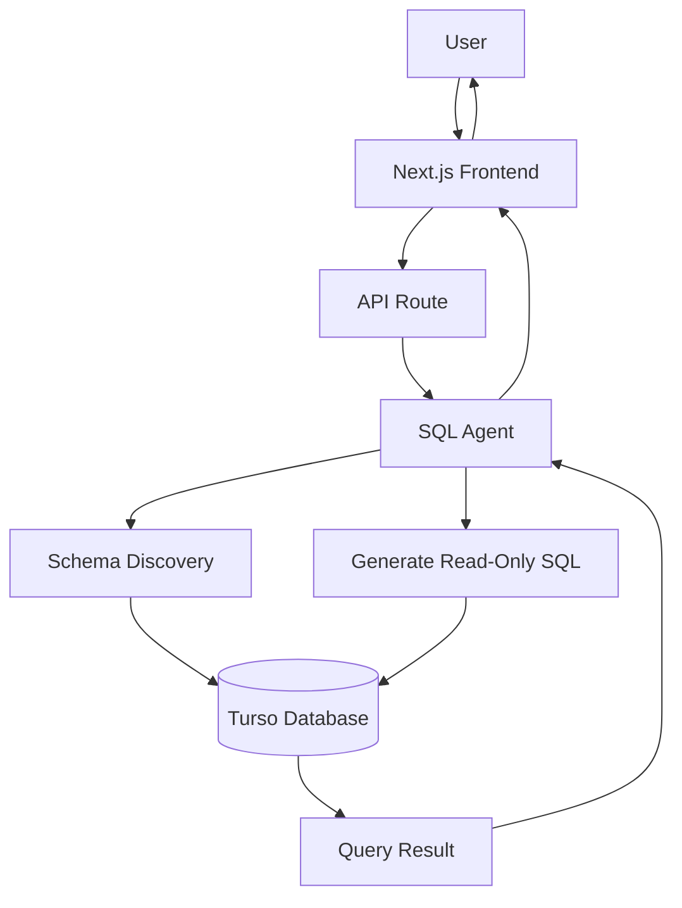

# 🤖 SQL Agent – Natural Language to SQL

An AI-powered SQL Agent that enables users to query relational databases using natural language.

Instead of writing SQL manually, users can simply ask questions such as:

* *"What is our total revenue in May?"*
* *"Show the top 5 selling products."*
* *"What was the average petrol price last month?"*

The agent automatically understands the user's intent, explores the database schema, generates safe SQL queries, executes them, and returns accurate results.

**Live Demo:** https://sql-agent-dw7lv0y0a-krishnas-projects-bb02b325.vercel.app

---

# 🎯 Problem Statement

Business users and non-technical stakeholders often need insights from relational databases but lack SQL knowledge.

Traditional BI tools require users to:

* Understand the database schema
* Write SQL queries
* Join multiple tables
* Interpret query results

This creates a barrier between business users and their data.

---

# 💡 Solution

The SQL Agent acts as an AI-powered database assistant.

Users ask questions in plain English, and the agent automatically:

* Discovers the database schema
* Understands table relationships
* Generates safe read-only SQL
* Executes the query
* Returns structured results

No SQL knowledge is required.

---

# 🚀 Features

* 💬 Natural Language to SQL
* 🧠 AI-Powered Query Generation
* 🔍 Automatic Schema Discovery
* 🛡️ Read-Only SQL Validation
* 🗄️ Turso (SQLite) Database Integration
* 📊 Structured Query Results
* ⚡ Fast AI Responses
* 🌐 Interactive Web Interface
* 🚫 Protection Against Destructive SQL Queries

---

# 🏗️ Architecture



---

# 🔄 Workflow

1. User submits a natural language question.

2. The SQL Agent inspects the database schema to understand available tables and columns.

3. Based on the schema, the LLM generates a safe SQL query.

4. The generated SQL is validated to ensure only read-only operations are allowed.

5. The query is executed against the Turso database.

6. Results are formatted and returned to the user.

---

# 🛡️ Safety Features

The SQL Agent only allows safe database operations.

Supported SQL statements:

* `SELECT`
* `WITH`
* `EXPLAIN`

Restricted operations include:

* DELETE
* UPDATE
* INSERT
* DROP
* ALTER
* TRUNCATE

This prevents accidental modification of production data.

---

# 🛠️ Tech Stack

### Frontend

* React
* Next.js

### Backend

* Node.js
* JavaScript

### AI

* Google Gemini
* Vercel AI SDK

### Database

* Turso
* SQLite
* Drizzle ORM

### Deployment

* Vercel

---

# 📂 Project Structure

```text
.
├── app/
│   ├── api/
│   └── page.js
│
├── tools/
│   ├── schemaTool.js
│   └── databaseTool.js
│
├── lib/
├── components/
├── public/
├── package.json
└── .env.local
```

---

# ⚙️ Installation

```bash
git clone https://github.com/your-username/sql-agent.git

cd sql-agent

npm install
```

---

# 🔑 Environment Variables

Create a `.env.local` file.

```env
GOOGLE_GENERATIVE_AI_API_KEY=your_google_api_key

TURSO_DATABASE_URL=your_database_url

TURSO_AUTH_TOKEN=your_turso_auth_token
```

---

# ▶️ Run the Project

```bash
npm run dev
```

Visit:

```
http://localhost:3000
```

---

# 💬 Example Queries

```text
What is our total revenue?

Show the top 10 selling products.

What was our revenue in May?

Which product generated the highest sales?

What is the average petrol price?

How many transactions were recorded this month?
```

---

# 🎯 Use Cases

* Business Intelligence
* Sales Analytics
* Retail Reporting
* Inventory Analysis
* Financial Reporting
* Natural Language Database Queries

---

# 🚀 Future Enhancements

* Multi-database Support (MySQL, PostgreSQL, SQL Server)
* Automatic Chart Generation
* AI-Powered Business Insights
* Conversation Memory
* Query History
* Export Results (CSV, Excel, PDF)
* Role-Based Access Control
* Multi-Agent Integration with Business Intelligence System

---

# 🌐 Live Demo

[SQL Agent Demo](https://sql-agent-dw7lv0y0a-krishnas-projects-bb02b325.vercel.app?utm_source=chatgpt.com)

---

# 🤝 Contributing

Contributions, suggestions, and feature requests are welcome.

Feel free to fork the repository and submit a pull request.

---

# 📄 License

This project is licensed under the MIT License.

---

## ⭐ If you found this project useful, consider giving it a Star!
